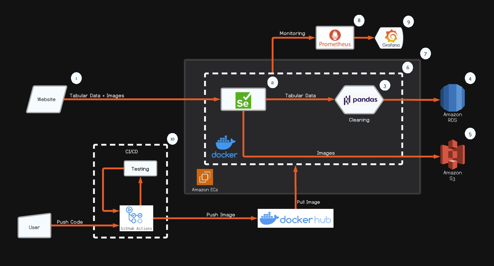
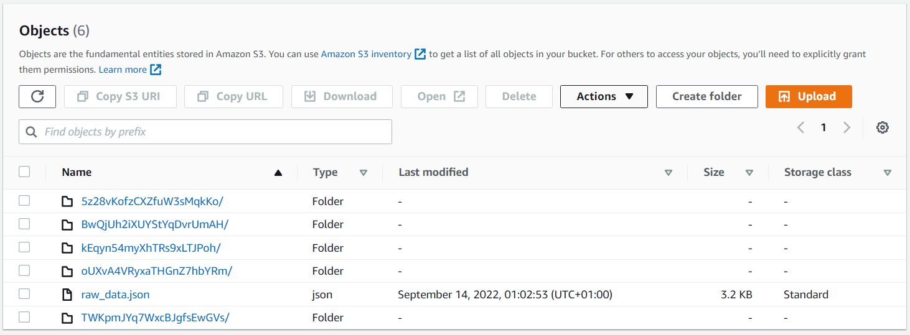
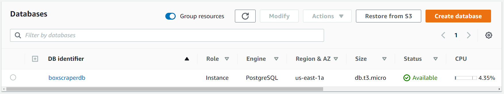
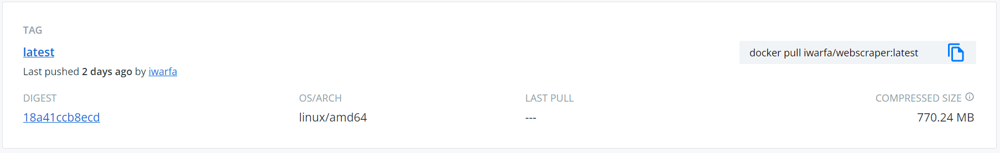
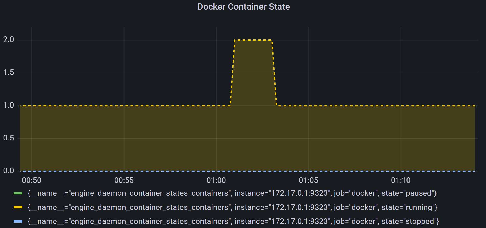
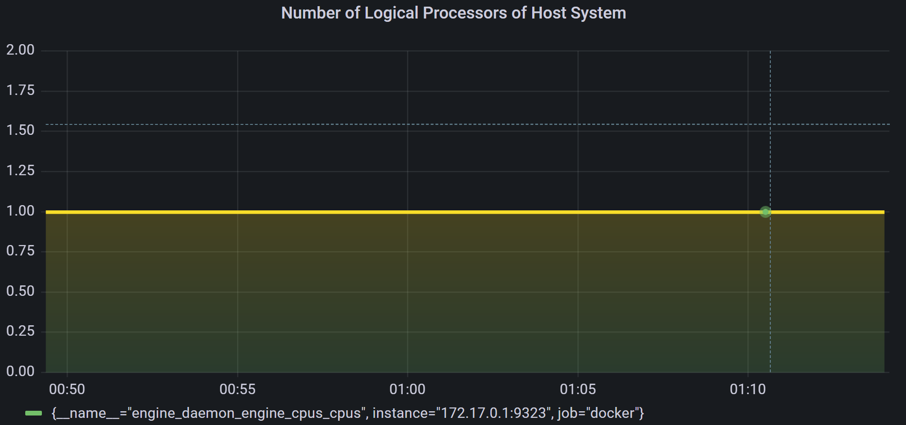

# Data Collection Pipeline Project

## Overview

> An end-to-end, scalable data-pipeline webscraper running on the cloud which scrapes product information of Nvidia graphics cards listings on the well-known UK-based Online PC & Electronics Store: https://www.box.co.uk



## Milestone 1 - Creating the Scraper Class

The selenium webdriver will be used for this project and all the required python libraries/packages that are used in order to build this webscraper can be found within the 'requirements.txt' file of this repository and can be installed using pip: 

`pip install <name_of_package>`

Rather than downloading the chromedriver executable for the chrome browser corresponding to the current chrome browser version, the 'webdriver-manager' library will be used. Therefore, there's no need to concern one's self with the setup and configuration of the chromedriver excutable as 'webdriver-manager' module handles this and makes building and deploying the scraper to docker easier in the latter steps. 

Using the code below, the landing page of the website can be loaded and the webpage of the desired product listings can be reached using the defined navigation actions.

```python
from selenium import webdriver
from selenium.webdriver.chrome.service import Service
from webdriver_manager.chrome import ChromeDriverManager
from selenium.webdriver.common.by import By
from selenium.webdriver.support.wait import WebDriverWait
from selenium.webdriver.support import expected_conditions as EC
from selenium.common.exceptions import TimeoutException
from selenium.common.exceptions import NoSuchElementException
from selenium.webdriver.common.action_chains import ActionChains
from time import sleep
```

```python
class BoxScraper():

    def __init__(self, landing_page_url: str = "https://www.box.co.uk"):

        service = Service(executable_path=ChromeDriverManager().install())

        self.driver = webdriver.Chrome(service=service)
        self.driver.set_window_size(1920,1080)
        self.driver.maximize_window()

        self.actions = ActionChains(self.driver)

        self.driver.get(landing_page_url)
        sleep(26)

        self.driver.refresh()

        print("\nWeb Scraper initiated. Web Driver executable is now running.\n")


    def __navigate_to_3060_cards(self):

        sleep(2)
        try:
            WebDriverWait(self.driver, 5).until(EC.presence_of_element_located((By.XPATH, "//a[normalize-space()='Computing']")))
            computing_tab = self.driver.find_element(By.XPATH, "//a[normalize-space()='Computing']")
            self.actions.move_to_element(computing_tab).perform()
        except TimeoutException:
            print("No computing tab found!")

        sleep(1)
        try:
            WebDriverWait(self.driver, 5).until(EC.presence_of_element_located((By.XPATH, "//a[normalize-space()='Components + Storage']")))
            components_and_storage = self.driver.find_element(By.XPATH, "//a[normalize-space()='Components + Storage']")
            self.actions.move_to_element(components_and_storage).perform()
        except TimeoutException:
            print("No component tab found!")

        sleep(1)
        try:
            WebDriverWait(self.driver, 5).until(EC.presence_of_element_located((By.XPATH, "(//a[contains(text(),'RTX 3060 Graphics Cards')])[1]")))
            product_3060_cards = self.driver.find_element(By.XPATH, "(//a[contains(text(),'RTX 3060 Graphics Cards')])[1]")
            self.actions.move_to_element(product_3060_cards).perform()
            self.actions.click(product_3060_cards).perform()
        except TimeoutException:
            print("No 3060 graphics product tab found!")

        sleep(2)
        try:
            list_view = WebDriverWait(self.driver, 5).until(EC.presence_of_element_located((By.XPATH, "(//div[@class='pq-list-view'])[1]")))
            self.actions.move_to_element(list_view).perform()
            self.actions.click(list_view).perform()
        except TimeoutException:
            print("Couldn't sort poroducts in list view, sorting is set to grid view!")

    def __scroll_down(self):

        # Get scroll height.
        last_height = self.driver.execute_script("return document.body.scrollHeight")

        while True:

            # Scroll down to the bottom.
            self.driver.execute_script("window.scrollTo(0, document.body.scrollHeight);")

            # Wait to load the page.
            sleep(2)

            # Calculate new scroll height and compare with last scroll height.
            new_height = self.driver.execute_script("return document.body.scrollHeight")

            if new_height == last_height:

                break

            last_height = new_height


    def __list_of_3060_cards(self):

        sleep(2)
        self.__scroll_down()

        if self.driver.find_elements(By.XPATH, "(//div[@class='product-list p-small-list'])//h3"):
            list_of_3060_cards = self.driver.find_elements(By.XPATH, "(//div[@class='product-list p-small-list'])//h3")
            print("Found the container holding the list of cards on first attempt!")
        else:
            list_of_3060_cards =  self.driver.find_elements(By.XPATH, "(//div[@class='product-list  p-small-list'])//h3")
            print("Found the container holding the list of cards on second attempt!")

        print(f"\nThere are {len(list_of_3060_cards)} cards in stock")

        # list of links for  cards obtained by extracting the 'href' via <a> of the web elements:
        list_of_links_for_3060 = []
        for rtx_3060 in list_of_3060_cards:
            list_of_links_for_3060.append(rtx_3060.find_element(By.TAG_NAME, 'a').get_attribute('href'))

        return list_of_links_for_3060
```

## Milestone 2 - Extracting Product Information

There are a range of interesting product details that that can be scraped, however, for the sake of simplicity and time efficiency with finding web elements, the following list of details have been scraped:

* Brand
* Product Name
* Price (£)
* Link
* Product Image URL
* Product Image (PNG/JPEG)

```python
import urllib.request
import json
import os
import shutil
import uuid
import shortuuid
import pandas as pd
```

```python
def __make_folder(self):

    global root_dir, raw_data

    root_dir = os.getcwd()
    raw_data = os.path.join(root_dir, 'raw_data')
    self.is_raw_data_there = os.path.exists(raw_data)

    if self.is_raw_data_there == True:
        shutil.rmtree(raw_data)
    else:
        os.makedirs(raw_data)
```

```python
def __data_collection(self):

    self.__make_folder()

    list_of_links_for_3060 = self.__list_of_3060_cards()

    if len(list_of_links_for_3060) >= 8:
        self.n = 8
    else:
        self.n = len(list_of_links_for_3060)

    self.product_list = []

    for link in list_of_links_for_3060[0:self.n]:

        indv_product_dictionary = {}

        self.driver.get(link)

        sleep(2)
        self.__scroll_down()

        # Append link to dictionary:
        indv_product_dictionary['Link'] = (link)

        # Get SKU/Friendly ID:
        self.sku = shortuuid.uuid()
        indv_product_dictionary['SKU'] = (self.sku)

        # Get Product Brand and Name:
        try:
            product_brand = WebDriverWait(self.driver, 15).until(EC.visibility_of_element_located((By.XPATH, "(//span[@class='breadcrumb-item'][5]//span)")))
            product_brand = product_brand.text
            indv_product_dictionary['Brand'] = (product_brand)
        except NoSuchElementException:
            indv_product_dictionary['Brand'] = ('N/A')

        # Get Product Name:
        try:
            product_name = WebDriverWait(self.driver, 15).until(EC.visibility_of_element_located((By.XPATH, "//h2[@class='p-title-desc']")))
            indv_product_dictionary['Product Name'] = (product_name.text)
        except NoSuchElementException:
            indv_product_dictionary['Product Name'] = ('N/A')

        # Generate UUID (Unique):
        try:
            unique_id = uuid.uuid4()
            unique_id = str(unique_id)
            indv_product_dictionary['Unique ID'] = (str(unique_id))
        except:
            indv_product_dictionary['Unique ID'] = ('N/A')

        # Get Image URL:
        try:
            self.image_url = WebDriverWait(self.driver, 15).until(EC.visibility_of_element_located((By.XPATH, "(//img[@class='p-image-button pq-images-small pq-images-show'])[1]"))).get_attribute('src')
            indv_product_dictionary['Product Image URL'] = (self.image_url)
        except NoSuchElementException:
            indv_product_dictionary['Product Image URL'] = ('N/A')

        # Get Item Price:
        try:
            price = WebDriverWait(self.driver, 15).until(EC.visibility_of_element_located((By.XPATH, "(//span[@class='pq-price'])[1]")))
            price = str(price.text)
            indv_product_dictionary['Price (£)'] = (float(price.strip('£')))
        except NoSuchElementException:
            indv_product_dictionary['Price (£)'] = ('N/A')

        # append each product dictionary to a list.
        self.product_list.append(indv_product_dictionary)

        # Create a folder for each product entry, named after its SKU.
        product_entries = os.path.join((root_dir), (raw_data), f"{self.sku}")
        os.makedirs(product_entries)
        with open(f'{product_entries}\data.json', 'w', encoding='utf-8') as fp:
            json.dump(indv_product_dictionary, fp, indent=4, ensure_ascii=False)

        # Create an 'images' Folder for each product image.
        images_folder = os.path.join(product_entries, "images")
        os.makedirs(images_folder)
        sleep(1)

        # Download individual product images to an 'Images' folder
        opener=urllib.request.build_opener()
        opener.addheaders=[('User-Agent','Mozilla/5.0 (Windows NT 10.0; Win64; x64) AppleWebKit/537.36 (KHTML, like Gecko) Chrome/104.0.0.0 Safari/537.36')]
        urllib.request.install_opener(opener)
        urllib.request.urlretrieve(self.image_url, f'{images_folder}\{self.sku}.jpg')
        sleep(1) 


    # Export the file containing all the GPU Product Data to a Json File and save locally within the 'raw_data' Folder.
    with open(f'{raw_data}/raw_data.json', 'w', encoding='utf-8') as f:
        json.dump(self.product_list, f, indent=4, ensure_ascii=False)

    # Does Number of sub-folder created equal to the number of products scraped?
    self.product_folder_count = len(next(os.walk(raw_data))[1])
    print(f"\n{self.product_folder_count} sub-folders have been created within the 'raw_data' folder of the root directory\n")

    # Transform the GPU Product List into a Panda DataFrame for AWS RDS Database storage.
    self.product_list_df = pd.DataFrame(self.product_list)    
    print(f"{self.product_list_df}")

    return self.product_folder_count
```

## Milestone 3 - Uploading & Storing the Data

For every instance that the scraper is ran, it's import to ensure that duplicates are not generated when files are uploaded to the S3 Bucket. Thus, a function that first check if the S3 Bucket exists and then empties the contents within the S3 Bucket must be made. 

This will also prevent files being overwritten as well as housing files of products from previous scraping runs which no longer exist on the target website. The files that are uploaded to the S3 Bucket are the raw data.json files and the images of the graphics cards in jpeg/png format.


```python
import boto3

def __aws_s3_client(self):

    self.s3 = boto3.client('s3')    # self.s3_client = boto3.Session().client(service_name='s3')

    r = boto3.resource('s3')
    if not r.Bucket('boxscraperbucket').creation_date is None:
        bucket = r.Bucket('boxscraperbucket')
        bucket.objects.all().delete()
```



Created a PostgreSQL Database using AWS RDS, to store the compiled data.json files of all the products which have been converted into a dataframe.




## Milestone 4 - Uploading Dataframe to AWS RDS PostgreSQL Database

Configured & initiated the connection to set up the AWS RDS PostgreSQL Database. Uploaded the scraped product data to the cloud database.

```python
from sqlalchemy import create_engine
from sqlalchemy.types import Integer, Text, String, DateTime, VARCHAR, FLOAT

def __initiate_psql_database(self):

    DATABASE_TYPE = 'postgresql'
    DBAPI = 'psycopg2'
    ENDPOINT = "scanscraperdb.cbq5lslbgwez.us-east-1.rds.amazonaws.com" # Change it for your AWS endpoint
    USER = 'postgres'
    PASSWORD = "cinnamon"
    PORT = 5432
    DATABASE = 'postgres'

    engine = create_engine(f"{DATABASE_TYPE}+{DBAPI}://{USER}:{PASSWORD}@{ENDPOINT}:{PORT}/{DATABASE}")
    engine.connect()
    
    # Upload product list dataframe to PostgreSQL database.
    self.product_list_df.to_sql(
                'gpu_products_data_set', 
                engine, 
                chunksize=500, 
                if_exists='replace', 
                dtype={
                    "SKU": Text,
                    "Brand": Text,
                    "Product Name": Text,
                    "Unique ID": Text,
                    "Price (£)": FLOAT,
                    "Link": Text,
                    "Product Image URL": Text
                    }
                )
```

## Milestone 5 - Containerising the Webscraper

The python script containing the code for the webscraper along with all the depencies is containerised in a docker image using the docker cli commands. The docker image can then be run in a docker container on any operating system. The image is then pushed to DockerHub.


```Dockerfile
# Specify image:tag
FROM python:3.9

# Update the system and install chrome
RUN apt-get -y update 
RUN apt -y -y upgrade 
RUN apt install -y wget
RUN wget https://dl.google.com/linux/direct/google-chrome-stable_current_amd64.deb
RUN apt install -y ./google-chrome-stable_current_amd64.deb

# Run a Bash command to make a Directory
RUN mkdir /mydirectory

# Set the Working Directory
WORKDIR /mydirectory 

# Copy files into the Working Directory of the Docker Container
COPY boxscraper.py /mydirectory/
COPY requirements.txt /mydirectory/

# Install the dependencies
RUN pip install -r requirements.txt

# Build the docker image using the command: 
    # "docker build -t name_of_image . "

# Run the docker container using command (add '-d' flag to run detached): 
    # "docker run --rm --name name_of_container -e AWS_ACCESS_KEY_ID=xyz -e AWS_SECRET_ACCESS_KEY=aaa name_of_image"

CMD [ "python", "boxscraper.py"]
```



## Milestone 6 Deploying the Scraper in the Cloud using AWS EC2

Creating an AWS EC2 Instance using the free-tier option, the scraper can be deployed in the cloud. However, the scraper needs to run in 'headless' mode (without a Graphical User Interface). This requires a modification of the scraper's init function:

```python

from selenium.webdriver.chrome.options import Options

def __init__(self, landing_page_url: str = "https://www.box.co.uk"):


    options = Options()
    options.add_argument("--headless")
    options.add_argument('--disable-gpu')
    options.add_argument("--disable-dev-shm-usage")
    options.add_argument('--no-sandbox')
    options.add_argument("--disable-logging")
    options.add_argument('user-agent=Mozilla/5.0 (Windows NT 10.0; Win64; x64) AppleWebKit/537.36 (KHTML, like Gecko) Chrome/104.0.0.0 Safari/537.36')
    options.add_argument("--disable-extensions")
    options.add_argument('disable-infobars')

    service = Service(executable_path=ChromeDriverManager().install())
    
    self.driver = webdriver.Chrome(service=service, options=options)
    self.driver.set_window_size(1920,1080)
    self.driver.maximize_window()

    self.actions = ActionChains(self.driver)
    
    self.driver.get(landing_page_url)
    sleep(26)
    
    # Helps with Diagnostics when issue occurs running scraper in headless mode.
    # self.driver.get_screenshot_as_file("screenshot.png")

    self.driver.refresh()

    print("\nWeb Scraper initiated. Web Driver executable is now running.\n")
```

## Milestone 7 Monitoring the Container using Prometheus & Grafana

The health of the docker engine running the webscraper can be monitored using a prometheus container running on the EC2 instance. To set up the prometheus container for monitoring docker, a 'prometheus.yml' file is created so the docker engine can be added to the list of scrape targets. Also, the daemon.json file is modified to work with the 'prometheus.yml' file:

```yaml
global:
  scrape_interval: 15s # By default, scrape targets every 15 seconds.
  # Attach these labels to any time series or alerts when communicating with
  # external systems (federation, remote storage, Alertmanager).
  external_labels:
    monitor: 'codelab-monitor'

# A scrape configuration containing exactly one endpoint to scrape:
# Here it's Prometheus itself.
scrape_configs:
  # The job name added as a label `job=<job_name>` to any timeseries scraped
  - job_name: 'prometheus'
    # Override the global default and scrape targets from job every 5 seconds.
    scrape_interval: '5s'
    static_configs:
      - targets: ['localhost:9090', '##.##.###.###:9090']
  # Docker monitoring
  - job_name: 'docker'
    static_configs:
      - targets: ['###.##.#.#:9323'] # metrics address from our daemon.json file.

```
The metrics can be monitored by configuring Grafana to work with Prometheus. The following Dashboards & Panels can be rendered:



 

